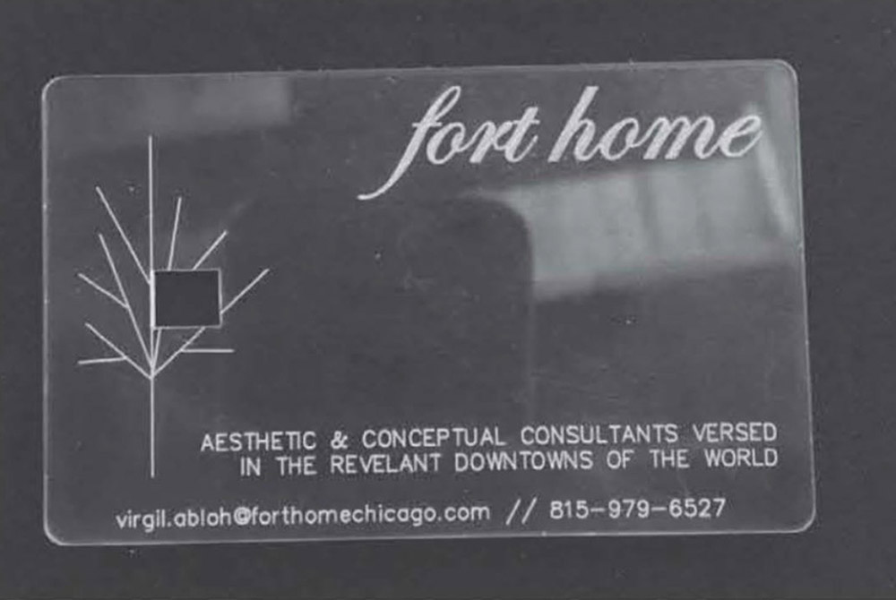
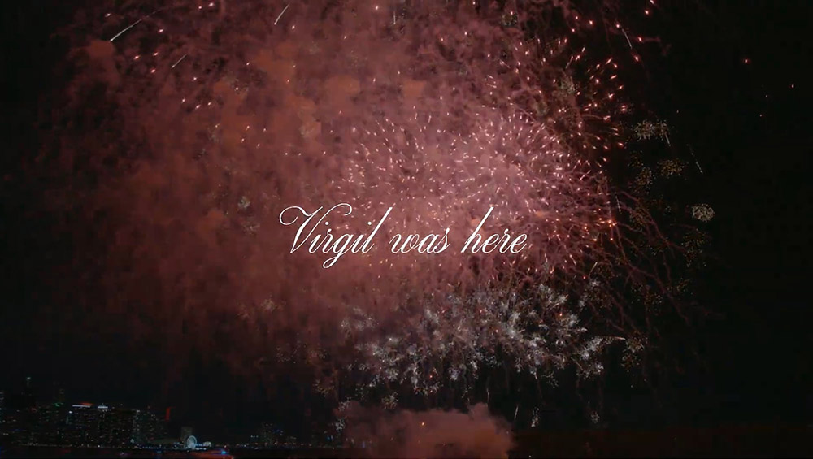

# Fort Home Chicago
In fall 2004, at the age of 24, the unparalleled artist [Virgil Abloh](https://virgilabloh.com/) started a design house called *Fort Home Chicago*. Assets used in the project predate that, with the banner spanning the bottom of the design house’s site taken from his first portfolio (circa 1998) titled *The Umbrella* [Reference no. A-IIT-0039]. Abloh undertook the project as an undergraduate student at University of Wisconsin–Madison.

Writing in his extensive catalog ["Figures of Speech"](https://gallery.canary---yellow.com/collections/home/products/mca-figures-of-speech-book-special-edition) for a homonymously titled mid-career retrospetive at the Museum of Contemporary Art, Chicago, Abloh said:
> Fort Home was a kind of collective that my friend Chris Easton and I started because we wanted to participate in what was happening in the streetwear/blog culture. But because we were from Chicago, we weren't aligned with any of the movements that were happening then, we started out own local thing, sort of spur of the moment, for a couple of summers in Chicago. The notion was of a creative space outside your comfort zone, and how Chris and I could, through design, take you there. There was a bit of “fake it ‘til you make it” in it, the idea that if you had a business card it must mean you're doing business. In the manifesto for Fort Home, designed by Eaton, that we wrote in 2004, you can see how the ideas that I built my practice on were seeded long before.

 

 

Abloh and Eaton's manifesto:
> an excerpt from our ever evolving mission statement / braggadocios streetwear rhetoric    Fort Home is a design house based on the premise of spreading oneself thin. We are a product of our golden era of design which included pink GT performers, Agassi sneakers, and head to toe Polo fits, Airwalk Prototypes, Oakley bulletproof sunglases etc.    By design we are interested in the aesthetics of objects and spaces in our everyday lives and only limited by the freedom of a concept. Our qualifications span the realms of architecture, djing, graphic design, product design, brand identity, marketing, etc.    We are interested in chicago civic lifestyle and the rising its standard of design. This website will serve as a resource to support this claim and in no specific medium will we be a contribution to it.    we are carrying the torch that Jordan lit...    basically, we are purveyors of this "lifestyle" campaigning for it to be less childish.

## FORT[Y-1]HOMECHICAGO
I wouldn’t be doing what I do without Virgil. His work and his being convinced a kid interested in art that he could be an artist. When, in 2020, the notification “virgilabloh liked a message” first popped up on my phone, I felt an exuberance I’ll never forget.

In September 2021, as his 41st birthday approached, I felt compelled to send Virgil something — a gift — in an attempt to convey the immesurable gratitute I felt for both him and his work. When I realized the domain name [forthomechicago.com](https://forthomechicago.com) was up for grabs, the plan became clear: restore an archived copy of the website, change the banner to read “FORT[Y-1]HOMECHICAGO” as a tip of the hat to his birthday, add some text toeing the line between humor and insight, and include a video chronicling the moments in his career that impacted me the most.

Looking back, there are things I’d like to change about both the text and video, but the gesture of this project is core to its being and I worry doing so would compromise its authenticity. The text was cowritten with GPT-2, a language model I was conducting research on at the time and which to this day I have a complicated relationship with. The video features archival footage from Abloh’s career atop a mix I made of Westside Gunn and MF DOOM’s *2 Stings* and Hank Shocklee’s remix of Jean-Michel Basquiat and Michael Holman’s *Bad Fool*.

VIRGIL FOREVER.  
🌪️🌪🌪️✨✨

 

